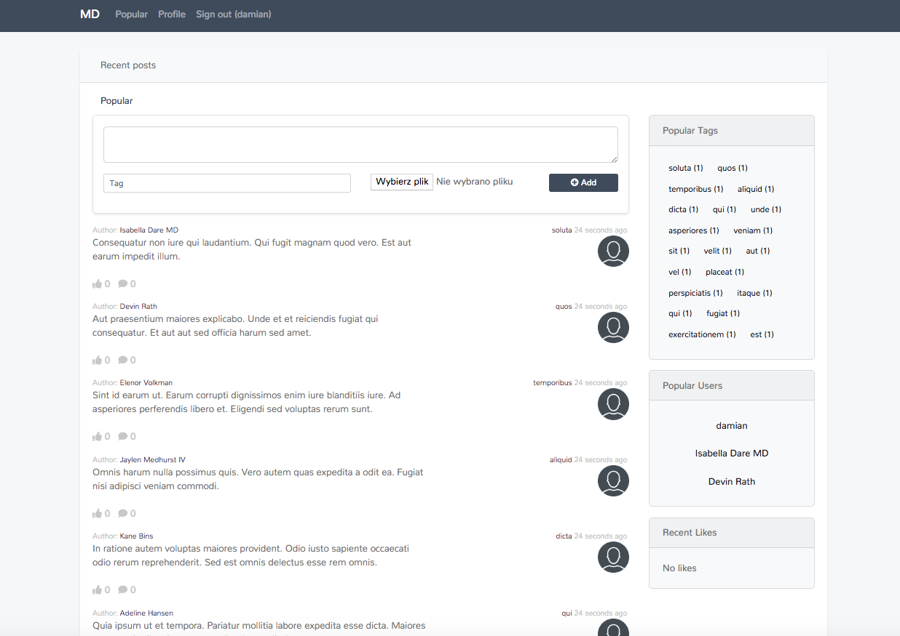

# MicroDisqus
> Simple discussion platform made in Laravel

* Post posts in tag categories
* Replies to post 
* Images in posts
* Liking posts and replies
* and so much more, install and see yourself :)



## Installation

```sh
composer install
```

setup your DB connection and then run

```sh
php artisan migrate --seed
php artisan serve
```

also don't forget to link storage

```sh
php artisan storage:link
```

## Meta

Damian Balandowski – balandowski@icloud.com
